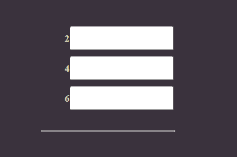

# 2 Что еще есть во Vue
## 2.1 Альтернативная инициализация vue

```js
Vue.createApp({
    data:() => ({
        title: 'Заголовок'
    })
}).mount("#app")
```

[Различные другие директивы, такие как v-cloak, v-html и др.](https://vuejs.org/guide/essentials/template-syntax.html)

## 2.2 Key
Существует специальный атрибут key, нужен для предотвращения бага с DOM обработчиком, когда из-за оптимизации удаляется не совсем тот элемент.
```html
<li>
    class="list-item"
    v-for="(item, i) in items"
    @click="items.splice(i, 1)"
    :key="item"
</li>
```

## 2.3 Фильтрация
```html
<!DOCTYPE html>
<html lang="en">
<head>
    <meta charset="UTF-8">
    <meta name="viewport" content="width=device-width, initial-scale=1.0">
    <link rel="stylesheet" href="style.css">
    <title>Document</title>
    <style>
        [v-cloak] {display: none;}
    </style>
</head>
<body>
    <div id="app" v-cloak class="container noselect">
        <div class="card">
            <ul>
                <li
                    v-for="(item, i) in evenItems"
                    @click="items.splice(i, 1)"
                    :key="item"
                >
                    <strong>{{ item }}</strong>
                    <input type="text" @click.stop>
                </li>
            </ul>
        </div>
    </div>

    <script src="https://unpkg.com/vue@3/dist/vue.global.js"></script>
    <script src="app.js"></script>
</body>
</html>
```

```js
Vue.createApp({
    data:() => ({
        items: [1, 2, 3, 4, 5, 6],

    }),
    methods: {

    },
    computed: {
        evenItems() {
            return this.items.filter(i => i % 2 === 0)
        }
    },
    watch: {
        
    }
}).mount("#app")
```

<div style="text-align:center"></div>

## 2.4 Модификаторы
Модификаторы позволяют избавиться от большого количества кода для обработки нажатий и определенных событий.
```html
<!DOCTYPE html>
<html lang="en">
<head>
    <meta charset="UTF-8">
    <meta name="viewport" content="width=device-width, initial-scale=1.0">
    <link rel="stylesheet" href="style.css">
    <title>Document</title>
    <style>
        [v-cloak] {display: none;}
    </style>
</head>
<body>
    <div id="app" v-cloak class="container noselect">
        <div class="card">
            <div>
                <input type="text" @keyup.shift.enter="addItem" ref="myInput">
            </div>
            <ul v-if="items.length">
                <li
                    v-for="(item, i) in items"
                    @click.right.prevent="items.splice(i, 1)"
                    :key="item"
                >
                    <strong>{{ item }}</strong>
                    <input type="text" @click.stop>
                </li>
            </ul>
        </div>
    </div>

    <script src="https://unpkg.com/vue@3/dist/vue.global.js"></script>
    <script src="app.js"></script>
</body>
</html>
```
```js
Vue.createApp({
    data:() => ({
        items: [1, 2],

    }),
    methods: {
        addItem(event) {
            this.items.unshift(this.$refs.myInput.value)
            this.$refs.myInput.value = ''
            console.log(event)
        },
    },
    computed: {
        evenItems() {
            return this.items.filter(i => i % 2 === 0)
        }
    },
    watch: {
        
    }
}).mount("#app")
```
[Модификаторы Vue JS](https://ru.vuejs.org/guide/essentials/event-handling.html)

## 2.5 Вызов нескольких функций
Просто перечисляем через запятую
```html
@click.right.prevent="remove(i), log(item)"
```