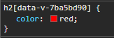
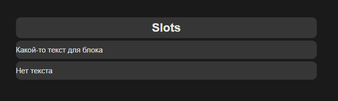
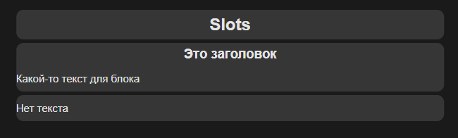
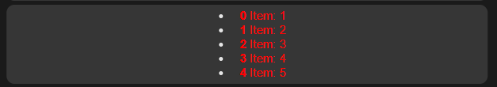
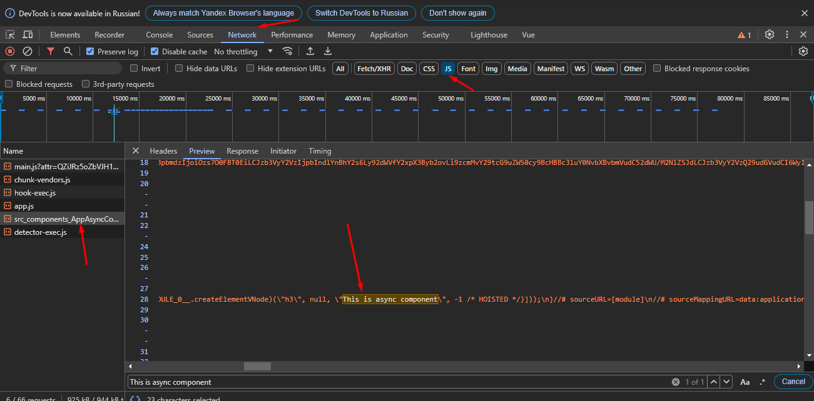

# 5 Все о компонентах
## 5.1 Создание и вызов компонент

Компоненты это переиспольуемые куски кода html с параметрами.
Компоненту можно регистрировать двумя способами:

```js
components: {
  'app-news': AppNews,
  AppNews
}
```
Тогда и вызывать можно двумя способами:
```html
<app-news></app-news>
<AppNews />
```

## 5.2 Emit

Метод __this.$emit()__ необходим, чтобы сообщить родительскому элементу об изменениях в дочернем элементе.
Первым параметром передается имя эмита, далее можно передать сколько угодно переменных.

## 5.3 Slot
Для передачи данных через привычный тег можно использовать __<slot \/>__. Тогда информация, помещенная между открытым и закрытым тегом компонента попадел в этот самый компонент на место слота. В примере передадим строку *"Прочесть новость"* в компоненту на место *<slot \/>*

```html
<app-button v-if="!wasRead" @action="mark" color="primary">Прочесть новость</app-button>
```
```html
<template>
    <button class="btn" :class="color" @click="$emit('action')">
        <slot />
    </button>
</template>
```

## 5.3 Provide, Inject
Во Vue 3 появлился новый способ передачи различных параметров и свойств между компонентами. Когда нам нужно пробросить что-то из родительского элемента в глубоко дочерний, минуя остальные дочерние элементы (промежуточные звенья).
Для этого на верхнем уровлне существует свойство __provide__, которое является объектом с данными, которые мы хотим передать, или функцией. Тогда все дочерние элементы смогут получить доступ до этих данных в provide.
Для получения этих данных необходимо воспользоваться свойством __inject__. inject это массив, где мы указываем название свойств, которые хотим получить.

```js
//provide: {title: 'Список всех новостей'},
provide() {
    return {
        title: 'Список всех новостей',
        news: this.news
    }
},
```
_Родительский элемент_


```html
<script>
​
export default {
    inject: ['title', 'news'],
}
</script>
```
_Дочерний элемент_

## 5.4 Стили компонентов
В каждом компоненте есть тег \<style>, который может хранить в себе css стили для данного компонента. В простом своем представлении данные стили распространяются также на дочерние элементы. Чтобы стили применялись только к данному классу, необходимо прописать
```html
<style scoped>
  h2 {
    color: red
  }
</>
```
При этом для атрибута на самом деле потом добавляется собственный хеш.

<div style="text-align:center"></div>

Также есть атрибут __lang__, где можно выбирать различный тип препроцессоров (sass, less, css, scss).
```html
<style scoped lang="scss">
  h2 {
    color: red
  }
</style>
```

## 5.5 Слоты (Slots)
Выше рассматривался тег \<slots />.
В действительности, в качествен слота может быть какой угодно контент.
Для слота можно задать параметр по-умолчанию на случай, если в родительском компоненте мы ничего не передадим.
```html
<div class="card">
  <h2>Slots</h2>
</div>

<app-block>
  <p>Какой-то текст для блока</p>
</app-block>

<app-block></app-block>
```

```html
<template>
  <div class="card">
    <slot>
      <p>Нет текста</p>
    </slot>
  </div>
</template>
```
<div style="text-align:center"></div>

Vue позволяет работать с несколькими слотами. Это называется коцепт именованных слотов.

```html
<div class="card">
  <h2>Slots</h2>
</div>

<app-block>
  <p>Какой-то текст для блока</p>
  <template v-slot:header>
    <h3>Это заголовок</h3>
  </template>
</app-block>

<app-block></app-block>
```

```html
<template>
  <div class="card">
    <slot name="header"></slot>
    <slot>
      <p>Нет текста</p>
    </slot>
  </div>
</template>
```

<div style="text-align:center"></div>
при этом у слота без названия на самом деле по умолчанию name="default".

Если мы в именной слот ничего не отправим, то можем получить пустые теги (например, если тот элемент был обернут в div). Чтобы этого избежать, можно использовать специальный системный объект, который называется slots. Его можно глянуть в консоле при mount страницы (__this.$slots__). В нем хранятся все слоты, которые мы передаем. Поэтому, можно сделать такую проверку.

```html
<div v-if="$slots.header">
    <slot name="header"></slot>
</div>
```

По аналогии с v-bind и v-on у слотов есть свой ярлык, который мы можем использовать. Поэтому, вместо __v-slot:__ можно писать __#__.

```html
<template v-slot:header>
  <h3>Это заголовок</h3>
</template>

<template #footer>
  <p>Это футер</p>
</template>
```

## 5.6 Передача параметров в slot
Для передачи каких-то свойств (например стилей) в дочерний слот, можно воспользоваться следующим способом:

```html
<app-list>
  <template #default="slotProps">
    <span style="color: red">
      <strong>{{ slotProps.idx }}</strong>
      Item: {{ slotProps.iter }}
    </span>
  </template>
</app-list>
```
```html
<!-- Файл app-list -->
<template>
    <div class="card">
        <ul>
            <li v-for="(item, i) in 5" :key="i">
                <slot :iter="item" :idx="i"></slot>
            </li>
        </ul>
    </div>
</template>

<script>
export default {
    
}
</script>

<style scope>
    
</style>
```
<div style="text-align:center"></div>

Для ES6 синтаксиса можно улучшить код следующим образом:
```html
<app-list>
    <template #default="{iter, idx}">
        <span style="color: red">
            <strong>{{ idx }}</strong>
            Item: {{ iter }}
        </span>
    </template>
</app-list>
```

## 5.7 Динамические компоненты
Реализуем систему табов. Будет две кнопки, которые будут подсвечиваться активными, благодаря которым мы сможем переключать определенный контент.

### Базовый подход:
Имеется две кнопки, в зависимости от того, какая кнопка активна (первая или втоая), показывается определенный контент (первый или второй).

```html
<template>
  <div class="container">
    <div class="card">
      <h2>Асинхронные и динамические компоненты</h2>

      <div class="row">
        <app-button
          :color="active === 'one' ? 'primary' : ''"
          @action="active = 'one'"
        >One</app-button>

        <app-button
          :color="active === 'two' ? 'primary' : ''"
          @action="active = 'two'"
        >Two</app-button>
      </div>
      
    </div>

    <app-text-one
      v-if="active === 'one'"
    ></app-text-one>

    <app-text-two
      v-else-if="active === 'two'"
    ></app-text-two>
    
  </div>
</template>

<script>
import AppButton from './components/AppButton.vue';
import AppTextOne from './components/AppTextOne.vue';
import AppTextTwo from './components/AppTextTwo.vue';

export default {
  data() {
    return {
      active: 'one' // two
    }
  },
  components: {AppButton, AppTextOne, AppTextTwo}
}
</script>
```

Проблема заключается в том, что при наличии не 2 вариантов контента, а, например, 10, нас появляется большое количество дублированного кода.

### Продвинутый подход

Необходимо применять динамичесий подход. Во Vue имеется специальный компонент `<component>`. Он имеет специальный параметр `:is`, в который необходимо передать в строковом формате имя компонента и тогда это место (\<component>\</component>) заменится переданным компонентом.

В простом виде это выглядит так:
```html
<component :is="'AppTextOne'"></component>
```
_AppTextOne - дочерний компонент_

В нашей задаче можно использовать следующим образом:

```html
<template>
  <div class="container">
    <div class="card">
      <h2>Асинхронные и динамические компоненты</h2>

      <div class="row">
        <app-button
          :color="active === 'one' ? 'primary' : ''"
          @action="active = 'one'"
        >One</app-button>

        <app-button
          :color="active === 'two' ? 'primary' : ''"
          @action="active = 'two'"
        >Two</app-button>
      </div>
      
    </div>

    <component :is="componentName"></component>
    
  </div>
</template>

<script>
import AppButton from './components/AppButton.vue';
import AppTextOne from './components/AppTextOne.vue';
import AppTextTwo from './components/AppTextTwo.vue';

export default {
  data() {
    return {
      active: 'one' // two
    }
  },
  computed: {
    componentName() {
      return 'app-text-' + this.active
    }
  },
  components: {AppButton, AppTextOne, AppTextTwo}
}
</script>
```

## 5.8 Как применить keep-alive
Если проинспектировать пример выше, то можно будет увидеть, что компоненты полностью перерисовываются, так как у компонентов разная структура.
Если бы например мы в одной из компонент имели input, то при переключении контент бы терялся. Проиходит так потому, что мы по сути заново создаем компонент.
Поэтому, нужно воспользоваться встроенным компонентом `keep-alive`.

```html
<keep-alive>
  <component :is="componentName"></component>
</keep-alive>
```
При такой обертке Vue сохраняет state компонента.

## 5.9 Расширенный синтаксис computed свойств
computed свойства можно определять не просто как функции, но также, можно к ним задавать геттеры и сеттеры.
В таком случае computed свойство является не функцией, а объектом.
По сути, по умолчанию, все computed свойства являются геттерами. 

```js
mounted() {
  this.componentName = 'new comp name' //тут работаем с сеттером
},
computed: {
  // componentName() {
  //   return 'app-text-' + this.active
  // },
  componentName: {
     get() {
      return 'app-text-' + this.active
    },
    set(value) {
      console.log('componentName: ' + value)
    }
  },
},
```

## 5.10 Получаем доступ к компоненту с ref
Ссылка дает доступ к компонентам, а также, доступ к их методам.

Имеем кнопку в родительском компоненте со ссылкой "myBtn" :

```html
<app-button
  ref="myBtn"
  :color="oneColor"
  @action="active = 'one'"
>One</app-button>
```
Сама кнопка представляет сосбой дочерний компонент и имеет метод btnLog() :

```html
<template>
    <button class="btn" :class="color" @click="$emit('action')">
        <slot />
    </button>
</template>

<script>
export default {
    emits: ['action'],
    props: {
        color: {
            type: String,
            default: '',
            validator(val) {
                return ['', 'primary', 'danger'].includes(val)
            }
        }
    },
    methods: {
        btnLog() {
            console.log('btn log')
        },
    }
}
</script>
```

Тогда, из родительского компонента можем получить доступ к методу дочернего элемента следующим образом:

```js
this.$refs.myBtn.btnLog()
```

## 5.11 Асинхронные компоненты
Асинхронные компоненты нужны когда мы хотим оптимизировать наше приложение. Когда нужно не сразу подгрузить код в бандл, а отдельно загрузить код и добавить его к приложению. 
Во Vue есть специальная функция `defineAsyncComponent`. В эту функцию передается callback функция, которая должна вернуть динамический импорт.
```js
import { createApp, defineAsyncComponent } from 'vue'
import App from './App.vue'
import TheHeader from './components/TheHeader.vue'
import './styles/style.css'

const app = createApp(App)
app.component('the-header', TheHeader)
app.component('async-component', defineAsyncComponent(() => {
    return import('./components/AppAsyncComponent.vue')
}))
app.mount('#app')
```
_Файл main.js_

1. Импортируем функцию defineAsyncComponent 
2. Регистрируем компоненту async-component
3. Передаем в функцию defineAsyncComponent callback функцию с динаическим импортом необходимой компоненты

Далее, можем использовать нашу компоненту "async-component"

```html
<template>
  <div class="container">
    <div class="card">
      <h2>Асинхронные и динамические компоненты</h2>     
    </div>

    <async-component></async-component>
    
  </div>
</template>
```

Убедиться в том, что переменная была загружена асинхронно можно в network.

<div style="text-align:center"></div>
Видно, что наш компонент зашит отдельно в рамках вебпака.