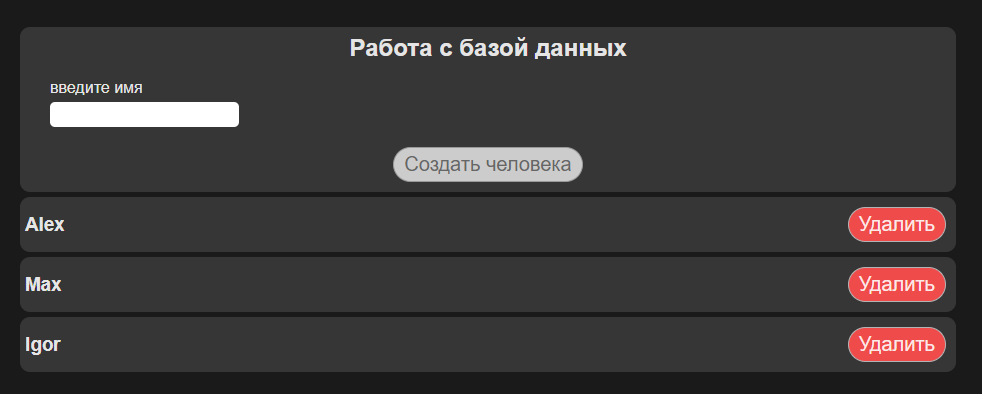

# 7 Работа с http и сервером

## 7.1 Готовим приложение с формой

<div style="text-align:center"></div>

### main.js
```js
import { createApp } from 'vue'
import App from './App.vue'
import './styles/style.css'

const app = createApp(App)
app.mount('#app')
```

---
### App.vue
```js
<template>
  <div class="container">
    <app-alert
      :alert="alert"
      @close="alert = null"
    ></app-alert>

    <form class="card" @submit.prevent="createPerson">
      <h2>Работа с базой данных</h2>

      <div class="form-control">
        <label for="name">введите имя</label>
        <input type="text" id="name" v-model.trim="name">
      </div>

      <button class="btn primary" :disabled="name.length === 0">Создать человека</button>
    </form>

    <app-people-list
      :people="people"
      @load="loadPeople"
      @remove="removePerson"
    ></app-people-list>

    <app-loader v-if="loading"></app-loader>
  </div>
</template>

<script>
import AppPeopleList from './components/AppPeopleList.vue'
import axios from 'axios'
import AppAlert from './components/AppAlert.vue'
import AppLoader from './components/AppLoader.vue'

export default {
  components: { AppPeopleList, AppAlert, AppLoader},
  data() {
    return {
      name: '',
      people: [],
      alert: null,
      loading: false,
    }
  },
  mounted() {
    this.loadPeople()
  },
  methods: {
    async createPerson() {
      // this.name
      // https://vuecourse-cd53f-default-rtdb.europe-west1.firebasedatabase.app/people.json

      const response = await fetch('https://vuecourse-cd53f-default-rtdb.europe-west1.firebasedatabase.app/people.json', {
        method: 'POST',
        headers: {
          'Content-Type': 'application/json'
        },
        body: JSON.stringify({
          firstName: this.name,
        })
      })

      const firebaseData = await response.json()

      this.people.push({
        firstName: this.name,
        id: firebaseData.name
      })

      this.name = ""
    },
    async loadPeople() {
      try {
        this.loading = true
        const {data} = await axios.get('https://vuecourse-cd53f-default-rtdb.europe-west1.firebasedatabase.app/people.json')
        if (!data) {
          throw new Error('Список людей пуст')
        }
        const result = Object.keys(data).map(key => {
          return {
            id: key,
            ...data[key]
          }
        })
        this.people = result
        this.loading = false
      } catch (e) {
        this.alert = {
          type: 'danger',
          title: 'Ошибка!',
          text: e.message
        }
        this.loading = false
        console.log(e)
      }

    },
    async removePerson(id) {
      try {
        const name = this.people.find(person => person.id === id).firstName
        await axios.delete(`https://vuecourse-cd53f-default-rtdb.europe-west1.firebasedatabase.app/people/${id}.json`)
        this.people = this.people.filter(person => person.id !== id)
        this.alert = {
          type: 'primary',
          title: 'Успешно',
          text: `Пользователь с именем ${name} был удален`
        }
      } catch (e) {
        this.alert = {
          type: 'danger',
          title: 'Ошибка!',
          text: e.message
        }
      }
    }
  }
}
</script>
```

---

### AppPeopleList.vue
```js
<template>
    <div v-if="people.length != 0">
        <div class="card inline" v-for="person in people" :key="person.id">
            <h3>{{ person.firstName }}</h3>
            <button class="btn danger" @click="$emit('remove', person.id)">Удалить</button>
        </div>
    </div>
    <div v-else>
        <div class="card">
            <h3>Людей пока нет</h3>
            <button class="btn" @click="$emit('load')">Загрузить список</button>
        </div>
    </div>
    
</template>

<script>
export default {
    emots: ['load', 'remove'],
    props: ['people']
}
</script>

<style scope>
    .inline {
        display: flex;
        flex-direction: row !important;
        justify-content: space-between;
        align-items: center;
    }
</style>
```


---

### AppAlert.vue
```js
<template>
    <div class="alert" v-if="alert" :class="alert.type">
        <h3>{{ alert.title }}</h3>
        <p>{{ alert.text }}</p>
        <button class="btn" :class="alert.type" @click="$emit('close')">Закрыть</button>
    </div>
</template>

<script>
export default {
    emits: ['close'],
    props: ['alert']
}
</script>

<style scope>
    .alert.danger {
        border: none;
        border-left: 5px solid #f04b4b;
        padding: 10px 20px;
        background: #363636;
        color: white;
    }
    .alert.danger:hover {
        background: #363636;
    }
    .alert.primary {
        border: none;
        border-left: 5px solid #0b6c8a;
        padding: 10px 20px;
        background: #363636;
        color: white;
    }
    .alert.primary:hover {
        background: #363636;
    }
</style>
```


---

### AppLoader.vue
```js
<template>
    <div class="loader">Loading...</div>
</template>

<style scope>
    .loader {
        color: white;
        display: flex;
        justify-content: center;
        font-size: 30px;
    }
</style>
```


---
