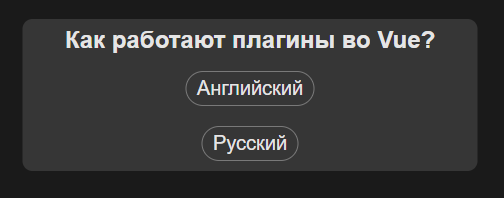

# 8 Миксины, директивы и плагины
## 8.1 Миксины (Mixin)

Миксины доступны во Vue 2 и 3 версии.
Проблема в том, что мы можем иметь похожие компоненты, которые имеют схожие переменные в родительском компоненте и мы вынуждены дублировать эти переменные или методы. __Mixins__ могут помочь нам в этой проблеме.

Можно создавать как глобальные миксины, так и локальные миксины.

```js
import { createApp } from 'vue'
import App from './App.vue'
import './styles/style.css'

const alertMixin = {
    data() {
        return {
            alert: false
        }
    },
    methods: {
        toggleAlert() {
            this.alert = !this.alert
        }
    }
}

const app = createApp(App)
app
.mixin(alertMixin)
.mount('#app')
```

Создали миксин, теперь для каждого компонента в поле data доступна переменная alert, а также метод toggleAlert().
То есть прописывать alert и toggleAlert больше нигде не нужно.

Проблема миксина в том, что нужно следить и не перетирвать его в компонентах (заново не создавать переменную alert и не объявлять метод toggleAlert)

Можно вынести миксин в отдельный файл (желательно)
```js
import { createApp } from 'vue'
import App from './App.vue'
import './styles/style.css'
import alertMixin from './alertMixin'


const app = createApp(App)
app
.mixin(alertMixin)
.mount('#app')
```
Файл alertMixin.js:
```js
export default {
    data() {
        return {
            alert: false
        }
    },
    methods: {
        toggleAlert() {
            this.alert = !this.alert
        }
    }
}
```


Все же глобально объявлять миксин это плохая практика. Возможны ошибки и уменьшение производительности приложения.

Поэтому, лучше объявлять миксин локально внутри какой-то компоненты.
```js
<script>
import AppAlert2 from './components/AppAlert2.vue'
import alertMixin from './alertMixin'
export default {
  mixins: [alertMixin],
  components: {AppAlert2},
}
</script>
```

## 8.2 Директивы

Все, что мы используем в шаблоне и все, что начинается с буквы "v-" (v-if, v-model, v-bimd, v-for...) - это все директивы.
Мы можем создать свою собственную директиву.
Директиву можно создать в глобальной области видимости и в локальной переменной. В глобальной области можно это сделать с помощью метода _.directive()_
Например так:
```js
const app = createApp(App)
    .directive('focus', {
        mounted(el) {
            console.log('Focus el', el)
        }
    })
    app.mount('#app')
```
Тут мы глобально создали директиву v-focus, которой добавили хук mounted.
Саму директиву используем на примере input:
```html
<template>
  <div class="container">
    <div class="card">
      <h2>Разговор про директивы</h2>

      <div class="form-control">
        <label for="inp">Активный по умолчанию</label>
        <input v-focus type="text" id="inp">
      </div>
    </div>
  </div>
</template>
```
В консоли получаем:
```
Focus el <input type=​"text" id=​"inp">​
```

Таким образом можем реализовать фокус на элемент инпут при обновлении страницы:
```js
const app = createApp(App)
    .directive('focus', {
        mounted(el) {
            el.focus()
        }
    })
    app.mount('#app')
```

---
Теперь повторим тот-же функционал, но в локальной компоненте
```html
<template>
  <div class="container">
    <div class="card">
      <h2>Разговор про директивы</h2>

      <div class="form-control">
        <label for="inp">Активный по умолчанию</label>
        <input v-focus type="text" id="inp">
      </div>
    </div>
  </div>
</template>

<script>
export default {
  directives: {
    focus: {
      mounted(el) {
        el.focus()
      }
    }
  }
}
</script>
```
---
Теперь вынесем это в отдельный файл ```focusDirective.js```
```js
export default {
    mounted(el) {
        el.focus()
    }
}
```
Тогда локальная компонента примет слледующий вид:
```html
<template>
  <div class="container">
    <div class="card">
      <h2>Разговор про директивы</h2>

      <div class="form-control">
        <label for="inp">Активный по умолчанию</label>
        <input v-focus type="text" id="inp">
      </div>
    </div>
  </div>
</template>

<script>
import focusDirective from './focusDirective';

export default {
  directives: {
    focus: focusDirective
  }
}
</script>
```
## 8.3 Жизненные циклы директивы

[Кастомне директивы описание](https://vuejs.org/guide/reusability/custom-directives.html)

У директив есть жизненные циклы, как и у компонент (beforeMount, mounted, beforeUpdate и т.д.)

Создадим директиву _color_. Создаем ее в отдельном файле и экспортируем.
```js
export default {
  mounted(el, binding) {
    console.log(el)
    console.log(binding)
  },
  updated() {

  },
  unmounted() {

  },
}
```
Иморируем ее в компоненте
```js
<script>
import colorDirective from './colorDirective';
import focusDirective from './focusDirective';

export default {
  directives: {
    focus: focusDirective,
    color: colorDirective
  }
}
</script>
```

И применим директиву к h2
```html
<h2 v-color>Разговор про директивы</h2>
```

Теперь при загрузке страницы мы получаем в консоли сам элемент и его __binding__.
<div style="text-align:center"></div>
Это различные свойства нашей директивы на объекте. Например, мы можем передать в директиву значение цвета.
```html
<h2 v-color="'red'">Разговор про директивы</h2>
```
Тогда binding.value будет имент значение 'red' и мы можем как-то использовать это значение. Например, изменить цвет текста:

```js
export default {
    mounted(el, binding) {
        console.log(el)
        console.log(binding)

        el.style.color = binding.value
    },
    updated() {

    },
    unmounted() {

    },
}
```

Хук mounted вызывается всего один раз! Если мы после этого попробуем поменять значение цвета в директиве, то ничего не произойдет. Динамического обновления цвета не получится.
Допишем этот функционал через хук updated, который вызывается каждый раз при изменении value нашей директивы.

```js
export default {
    mounted(el, binding) {
        console.log(el)
        console.log(binding)

        el.style.color = binding.value
    },
    updated(el, binding) {
        el.style.color = binding.value
    },
    unmounted() {

    },
}
```
```html
<template>
  <div class="container">
    <div class="card">
      <h2 v-color="myColor">Разговор про директивы</h2>

      <div class="form-control">
        <label for="inp">Активный по умолчанию</label>
        <input v-focus type="text" id="inp">
      </div>

      <button class="btn" @click="myColor = 'blue'">Сделать синим</button>
    </div>
  </div>
</template>

<script>
import colorDirective from './colorDirective';
import focusDirective from './focusDirective';

export default {
  data() {
    return {
      myColor: 'red'
    }
  },
  directives: {
    focus: focusDirective,
    color: colorDirective
  }
}
</script>
```
Теперь при нажатии на кнопку, переменная myColor изменится на значение 'blue' и наш элемент h2 покрасится в синий цвет.

## 8.4 Передача параметров в директиву

В директиву мы можем передавать параметры разного типа и модификаторы.
Попробуем на примере выше менять не цвет текста, а настраивать будет ли это цвет текста или фон текста.

Передадим в директиву параметр 'color'

```html
<h2 v-color:color="myColor">Разговор про директивы</h2>
```
<div style="text-align:center"></div>

Можно заметить, что этот параметр появился в _arg_
Теперь можем использовать стиль элемента более динамично.

```js
export default {
    mounted(el, binding) {
        console.log(el)
        console.log(binding)

        el.style[binding.arg] = binding.value
    },
    updated(el, binding) {
        el.style[binding.arg] = binding.value
    },
    unmounted() {

    },
}
```

А если захотим поменять цвет заднего фона, то это можно будет сделать так:

```html
<h2 v-color:background="myColor">Разговор про директивы</h2>
```

Мы можем динамически переключать этот параметр (переключать тип между color и background).

```html
<template>
  <div class="container">
    <div class="card">
      <h2 v-color:[type]="myColor">Разговор про директивы</h2>

      <div class="form-control">
        <label for="inp">Активный по умолчанию</label>
        <input v-focus type="text" id="inp">
      </div>

      <button class="btn" @click="myColor = 'blue'">Сделать синим</button>
      <button class="btn" @click="type = type == 'color' ? 'background' : 'color'">Переключить тип</button>
    </div>
  </div>
</template>

<script>
import colorDirective from './colorDirective';
import focusDirective from './focusDirective';

export default {
  data() {
    return {
      myColor: 'red',
      type: 'color',
    }
  },
  directives: {
    focus: focusDirective,
    color: colorDirective
  }
}
</script>
```

Важно заметить, что аргумент _type_ теперь динамический и должен передаваться в директиву в квадратных скобках.

```html
<h2 v-color:[type]="myColor">Разговор про директивы</h2>
```

## 8.5 Работа с модификаторами директивы
Модификаторов можно добавлять сколько угодно через "."

Например, мы добавили модификаторы "blink" и "abc":
```html
<h2 v-color:[type].blink.abc="myColor">Разговор про директивы</h2>
```

<div style="text-align:center"></div>

Тогда в параметре "_modifiers_" мы увидим эти модификаторы.
Их можно в дальнейшем использовать в директиве для какой-то логики.

В методе unmounted нужно чистить различные интервалы, таймауты и т.п., чтобы не было никаких утечек.

## 8.6 Создание своего плагина

Плагины - мощная система во Vue, позволяющая расширять функционал.

Создадим плагин ```translatePlugin.js```
Плагин должен представлять собой объект, у которого должно быть реализован метод __install()__.

```js
export default {
    install() {
        
    }
}
```

Метод _install_ принимает в себя два параметра (app, options). Сразу сделаем их вывод в консоль.

```js
export default {
    install(app, options) {
        console.log('app', app)
        console.log('options', options) 
    }
}
```

Чтобы работать с плагинами, нужно их зарегистрировать в приложении. У нашего приложения app необходимо вызвать метод use и передать в него ранее импортированный плагин:


```js
import { createApp } from 'vue'
import App from './App.vue'
import './styles/style.css'
import translatePlugin from './translatePlugin'

const app = createApp(App)

app.use(translatePlugin)

app.mount('#app')
```

Посмотри что появилось в консоли:
<div style="text-align:center"></div>

Объект _app_ это по сути и есть наше приложение. У него есть раздичные методы, миксины, директивы и т.д.

Параметры _options_ передаются в методе use:


```js
import { createApp } from 'vue'
import App from './App.vue'
import './styles/style.css'
import translatePlugin from './translatePlugin'


const app = createApp(App)

app.use(translatePlugin, {test: 1})

app.mount('#app')
```
То есть мы сами придумываем какой параметр передавать в options и передавать ли его вообще.

В нашем плагине в методе install мы можем взаимодействовать с нашим функционалом. Например, задавать какие-то методы.

Мы можем задавать в глобальные переменные какие-то свойства и методы через наш плагин. Например, сделаем метод alert, который будет являться обычным алертом в браузере.


```js
export default {
    install(app, options) {
        app.config.globalProperties.$alert = text => {
            window.alert(text)
        }
    }
}
```
Знак "\$" рекомендуется использовать, чтобы визуально отделить системные методы от каких-то внутренних методов. 

Теперь в приложении можем например создать кнопку, при клике на которую будем вызывать метод __$alert__ и передавать в него какой-то текст. При этом на странице будет показываться обычный alert с переданным текстом.

```html
<template>
  <div class="container">
    <div class="card">
      <h2>Как работают плагины во Vue?</h2>

      <button class="btn" @click="$alert('Wow it is working!')">Alert</button>
    </div>
  </div>
</template>

<script>
export default {
  
}
</script>
```

Можем также вызывать этот метод из js шаблона, например, при маунте страницы:

```html
<script>
export default {
  mounted() {
    this.$alert('Some text for alert')
  }
}
</script>
```

## 8.7 Пример. Создание плагина мультиязычности
Рассмотрим, как мы можем сделать плагин для мультиязычности во Vue.

Ключи должны содержаться в каком-то словаре. Сделаем этот словарь локально в гавном файле main.js и передадим словари в наш плагин. По умолчанию будем иметь русский язык.

```js
import { createApp } from 'vue'
import App from './App.vue'
import './styles/style.css'
import translatePlugin from './translatePlugin'

const app = createApp(App)

const ru = {
    app: {
        title: 'Как работают плагины во Vue?'
    }
}
const en = {
    app: {
        title: 'How do plugins work in Vue?'
    }
}

app.use(translatePlugin, {ru, en})

app.mount('#app')
```

Создадим в плагине метод "i18n", который будет принимать в себя ключ и отдавать значение текста на нужном нам языке. Если ключа нет, то возвращаться будет строка "=== UNKNOWN ==="

```js
export default {
  install(app, options) {
    let currentLang = 'ru'

    const changeLanguage = lang => {
      currentLang = lang
    }

    app.config.globalProperties.$i18n = key => {
      //app.title -> ['app', 'title']
      return key.split('.').reduce((words, k) => {
        return words[k] || '=== UNKNOWN ==='
      }, options[currentLang])
    }

    app.provide('changeI18N', changeLanguage)
  }
} 
```

Провайдим функцию "changeI18N" чтобы использовать (инжектить) потом ее в нашей компоненте. Эта функция вызывает локальный метод плагина, который меняет язык.

То есть из компоненты приложения мы должны будем заинжектить метод "changeI18N" и передать в него какой-то язык ```this.changeI18N('ru')```.

Так будет выглядеть наша компонента:
```html
<template>
  <div class="container">
    <div class="card">
      <!-- <h2>Как работают плагины во Vue?</h2> -->
      <h2>{{ $i18n('app.title') }}</h2>

      <button class="btn" @click="changeLang('en')">Английский</button>
      <button class="btn" @click="changeLang('ru')">Русский</button>
    </div>
  </div>
</template>

<script>
export default {
  inject: ['changeI18N'],
  methods: {
    changeLang(lang) {
      this.changeI18N(lang)

      //Встроенный метод Vue для принудительного обновления страницы
      this.$forceUpdate()
    }
  }
}
</script>
```
<div style="text-align:center"></div>

## 8.7 Пример. Модальное окно с Teleport

Создадим отдельный компонент, который будет являться компонентом модального окна.
НСимантически не очень удобно, когда модалка лежит посреди DOM дерева. Это например может мешать работе роботов на сайте. 

Поэтому, целесообразнее использовать готовый Vue компонент __`<Teleport>`__. И внутрь него мы уже кладем нашу модалку.
У этого компонента есть два параметра (to, disabled)
to - куда мы будем телепортировать наш компонент (__body__ или какойто элемент с id __#modal__).
disabled - пареметр, который мы указываем когда хотим, чтобы элемент не телепортировался.

```html
<template>
  <div class="container">
    <div class="card">
      <h2>Как работают плагины во Vue?</h2>
      <button class="btn primary" @click="isModal = true">Открыть модалку</button>
      
    </div>
  </div>
  <teleport to="body">
    <app-modal 
      v-if="isModal"
      @close="isModal = false"
    ></app-modal>
  </teleport>
</template>

<script>
import AppModal from './components/AppModal.vue';

export default {
  data() {
    return {
      isModal: false,
    }
  },
  methods: {
    
  },
  components: {AppModal},
}
</script>
```

Компонента модалки:

```html
<template>
    <div class="modal-backdrop" @click="$emit('close')"></div>
    <div class="modal">
        <h3>Это заголовок модалки</h3>
        <p>Lorem ipsum, dolor sit amet consectetur adipisicing elit. Recusandae asperiores adipisci fugit, eaque nobis consequuntur unde magni quaerat eligendi. Vero!</p>
    </div>
</template>

<script>
export default {
    emits: ['close'],
}
</script>

<style scope>
    
</style>
```