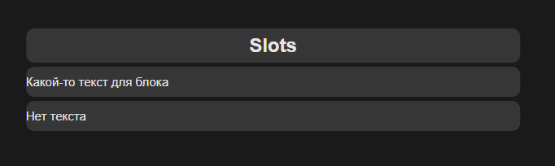
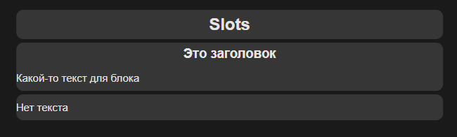

██╗░░░██╗██╗░░░██╗███████╗  ░░░░░██╗░██████╗
██║░░░██║██║░░░██║██╔════╝  ░░░░░██║██╔════╝
╚██╗░██╔╝██║░░░██║█████╗░░  ░░░░░██║╚█████╗░
░╚████╔╝░██║░░░██║██╔══╝░░  ██╗░░██║░╚═══██╗
░░╚██╔╝░░╚██████╔╝███████╗  ╚█████╔╝██████╔╝
░░░╚═╝░░░░╚═════╝░╚══════╝  ░╚════╝░╚═════╝░
---
# 1 Основы
## 1.1 Пример кода простого приложения (1)
```js
const App = {
    data() {
        return {
            counter: 0,
        }
    }
}

Vue.createApp(App).mount("#app")
```

```html
<!DOCTYPE html>
<html lang="en">
<head>
    <meta charset="UTF-8">
    <meta name="viewport" content="width=device-width, initial-scale=1.0">
    <link rel="stylesheet" href="style.css">
    <title>Document</title>
    
</head>
<body>
    <div id="app" class="container noselect">
        <div class="card">
            <h1>Счетчик: {{ counter }}</h1>
            <div class="row">
                <div class="btn" v-on:click="counter++">+</div>
                <div class="btn" @click="counter--">-</div>
            </div>
        </div>
    </div>

    <script src="https://unpkg.com/vue@3/dist/vue.global.js"></script>
    <script src="app.js"></script>
</body>
</html>
```

<div style="text-align:center"></div>

## 1.2 Пример кода простого приложения (2)
```js
const App = {

    data() {
        return {
            title: 'Список',
            placeholderText: 'Введите текст',
            inputValue: '',
            notes: ['Заметка 1', 'Заметка 2']
        }
    },
    methods: {
        inputChangeHandler(event) {
            this.inputValue = event.target.value
        },
        addNewNote() {
            this.notes.push(this.inputValue)
            this.inputValue = ''
        },
        removeNote(index) {
            this.notes.splice(index, 1)
        },
    }
}

Vue.createApp(App).mount("#app")
```

```html
<!DOCTYPE html>
<html lang="en">
<head>
    <meta charset="UTF-8">
    <meta name="viewport" content="width=device-width, initial-scale=1.0">
    <link rel="stylesheet" href="style.css">
    <title>Document</title>
    
</head>
<body>
    <div id="app" class="container noselect">
        <div class="card">
            <h1>{{ title }}</h1>
            <div class="form-control">
                <input 
                    type="text"
                    v-bind:placeholder="placeholderText"
                    v-bind:value="inputValue"
                    v-on:input="inputChangeHandler"
                    v-on:keypress.enter="addNewNote"
                />
            </div>
            <div class="btn" v-on:click="addNewNote">Добавить</div>
            <div class="row" v-for="(note, idx) in notes">
                <h2>{{idx + 1}}. {{ note }}</h2>
                <div class="btn" v-on:click="removeNote(idx)">x</div>
            </div>
            
        </div>
    </div>

    <script src="https://unpkg.com/vue@3/dist/vue.global.js"></script>
    <script src="app.js"></script>
</body>
</html>
```

<div style="text-align:center"></div>

## 1.3 Сокращения

Для сокращения вместо "v-bind:" можно писать ":", а вместо "v-on:" писать "@". Пример использования сокращений:

```html
<!DOCTYPE html>
<html lang="en">
<head>
    <meta charset="UTF-8">
    <meta name="viewport" content="width=device-width, initial-scale=1.0">
    <link rel="stylesheet" href="style.css">
    <title>Document</title>
    
</head>
<body>
    <div id="app" class="container noselect">
        <div class="card">
            <h1>{{ title }}</h1>
            <div class="form-control">
                <input 
                    type="text"
                    :placeholder="placeholderText"
                    :value="inputValue"
                    @input="inputChangeHandler"
                    @keypress.enter="addNewNote"
                />
            </div>
            <div class="btn" @click="addNewNote">Добавить</div>
            <div class="row" v-for="(note, idx) in notes">
                <h2>{{idx + 1}}. {{ note }}</h2>
                <div class="btn" @click="removeNote(idx)">x</div>
            </div>
            
        </div>
    </div>

    <script src="https://unpkg.com/vue@3/dist/vue.global.js"></script>
    <script src="app.js"></script>
</body>
</html>
```

## 1.4 Computed

Computed (вычисляемые) свойства должны что-то возвращать и зависить от каких-то переменных приложения.
Обращаться к ним надо не как к свойствам, а как к обычным переменным, т.к. это по сути геттеры и сеттеры.
<ins>Методы computed будут вызываться только если будут меняться переменные внутри этих методов.</ins> Пример:
```html
<h2>Всего элементов: {{ notes.length }} | Удвоенное кол-во: {{ doubleCountComputed }}</h2>
```

```js
const App = {

    data() {
        return {
            title: 'Список',
            placeholderText: 'Введите текст',
            inputValue: '',
            notes: ['Заметка 1', 'Заметка 2']
        }
    },
    methods: {
        inputChangeHandler(event) {
            this.inputValue = event.target.value
        },
        addNewNote() {
            if(this.inputValue === '') return
            this.notes.push(this.inputValue)
            this.inputValue = ''
        },
        removeNote(index) {
            this.notes.splice(index, 1)
        },
        doubleCount() {
            console.log('doubleCount')
            return this.notes.length * 2
        }
    },
    computed: {
        doubleCountComputed() {
            console.log('doubleCountComputed')
            return this.notes.length * 2
        }
    }
}

Vue.createApp(App).mount("#app")
```

## 1.5 Watch
С этим свойством мы можем следить за любыми переменными. Например будем следить за переменной inputValue, для этого в объекте watch нужно создать метод, совпадающий по названию с переменной.
```js
const App = {

    data() {
        return {
            title: 'Список',
            placeholderText: 'Введите текст',
            inputValue: '',
            notes: ['Заметка 1', 'Заметка 2']
        }
    },
    methods: {
        inputChangeHandler(event) {
            this.inputValue = event.target.value
        },
        addNewNote() {
            if(this.inputValue === '') return
            this.notes.push(this.inputValue)
            this.inputValue = ''
        },
        removeNote(index) {
            this.notes.splice(index, 1)
        },
        doubleCount() {
            console.log('doubleCount')
            return this.notes.length * 2
        }
    },
    computed: {
        doubleCountComputed() {
            console.log('doubleCountComputed')
            return this.notes.length * 2
        }
    },
    watch: {
        inputValue(value) {
            if(value.length > 10) this.inputValue = ''
            console.log('input value watch: ' + value)
        }
    }
}

Vue.createApp(App).mount("#app")
```

## 1.6 V-model

Позволяет заменить обработку события и например убрать __v-bind:value__ и __v-on:input__ с их функциями обработки.

Пример:

```html
<input 
 type="text"
 :placeholder="placeholderText"
 :value="inputValue"
 @input="inputChangeHandler"
 @keypress.enter="addNewNote"
/>
```
Меняется на:
```html
<input 
 type="text"
 :placeholder="placeholderText"
 v-model="inputValue"
 @keypress.enter="addNewNote"
/>

```

## 1.7 Style
Для прописывание стилей нужно ставить объект.

Когда пишем свойства для стилизации объектов со стороны JS, и свойство состоит из нескольких слов (пример font-size), то нужно использовать cammelCase (fontSize)
```html
<h1 :style="{
  color: inputValue.length < 3 ? 'red' : 'green',
  fontSize: inputValue.length < 5 ? '20px' : '30px'
}">{{ title }}</h1>
```

## 1.8 Class

Вариант 1) Объект, как в стилях, ставить не нужно.

```html
<h2 :class="idx == 1 ? 'oneClass' : 'secondClass'">{{idx + 1}}. {{ note }}</h2>
```

Вариант 2) Задаем объект и указываем название класса, а потом прописываем условие для него

```html
<h2 :class="{
  'oneClass': idx == 1,
  'secondClass': idx != 1
}">{{idx + 1}}. {{ note }}</h2>
```

Вариант 3) Можем передать массив, в качестве элементов массива можем передавать какие-то классы и объекты.

```html
<h2 :class="['oneClass', {'secondClass': idx != 1}]">{{idx + 1}}. {{ note }}</h2>
```
Тут все элементы получат класс 'oneClass', а класс 'seconsClass' получат только элементы, у которых выполнится условие

# 2 Что еще есть во Vue
## 2.1 Альтернативная инициализация vue

```js
Vue.createApp({
    data:() => ({
        title: 'Заголовок'
    })
}).mount("#app")
```

[Различные другие директивы, такие как v-cloak, v-html и др.](https://vuejs.org/guide/essentials/template-syntax.html)

## 2.2 Key
Существует специальный атрибут key, нужен для предотвращения бага с DOM обработчиком, когда из-за оптимизации удаляется не совсем тот элемент.
```html
<li>
    class="list-item"
    v-for="(item, i) in items"
    @click="items.splice(i, 1)"
    :key="item"
</li>
```

## 2.3 Фильтрация
```html
<!DOCTYPE html>
<html lang="en">
<head>
    <meta charset="UTF-8">
    <meta name="viewport" content="width=device-width, initial-scale=1.0">
    <link rel="stylesheet" href="style.css">
    <title>Document</title>
    <style>
        [v-cloak] {display: none;}
    </style>
</head>
<body>
    <div id="app" v-cloak class="container noselect">
        <div class="card">
            <ul>
                <li
                    v-for="(item, i) in evenItems"
                    @click="items.splice(i, 1)"
                    :key="item"
                >
                    <strong>{{ item }}</strong>
                    <input type="text" @click.stop>
                </li>
            </ul>
        </div>
    </div>

    <script src="https://unpkg.com/vue@3/dist/vue.global.js"></script>
    <script src="app.js"></script>
</body>
</html>
```

```js
Vue.createApp({
    data:() => ({
        items: [1, 2, 3, 4, 5, 6],

    }),
    methods: {

    },
    computed: {
        evenItems() {
            return this.items.filter(i => i % 2 === 0)
        }
    },
    watch: {
        
    }
}).mount("#app")
```

<div style="text-align:center"></div>

## 2.4 Модификаторы
Модификаторы позволяют избавиться от большого количества кода для обработки нажатий и определенных событий.
```html
<!DOCTYPE html>
<html lang="en">
<head>
    <meta charset="UTF-8">
    <meta name="viewport" content="width=device-width, initial-scale=1.0">
    <link rel="stylesheet" href="style.css">
    <title>Document</title>
    <style>
        [v-cloak] {display: none;}
    </style>
</head>
<body>
    <div id="app" v-cloak class="container noselect">
        <div class="card">
            <div>
                <input type="text" @keyup.shift.enter="addItem" ref="myInput">
            </div>
            <ul v-if="items.length">
                <li
                    v-for="(item, i) in items"
                    @click.right.prevent="items.splice(i, 1)"
                    :key="item"
                >
                    <strong>{{ item }}</strong>
                    <input type="text" @click.stop>
                </li>
            </ul>
        </div>
    </div>

    <script src="https://unpkg.com/vue@3/dist/vue.global.js"></script>
    <script src="app.js"></script>
</body>
</html>
```
```js
Vue.createApp({
    data:() => ({
        items: [1, 2],

    }),
    methods: {
        addItem(event) {
            this.items.unshift(this.$refs.myInput.value)
            this.$refs.myInput.value = ''
            console.log(event)
        },
    },
    computed: {
        evenItems() {
            return this.items.filter(i => i % 2 === 0)
        }
    },
    watch: {
        
    }
}).mount("#app")
```
[Модификаторы Vue JS](https://ru.vuejs.org/guide/essentials/event-handling.html)

## 2.5 Вызов нескольких функций
Просто перечисляем через запятую
```html
@click.right.prevent="remove(i), log(item)"
```

# 3 Как работает Vue

## 3.1 Свойство template

```html
<!DOCTYPE html>
<html lang="en">
<head>
    <meta charset="UTF-8">
    <meta name="viewport" content="width=device-width, initial-scale=1.0">
    <link rel="stylesheet" href="style.css">
    <title>Document</title>
</head>
<body>
    <div id="app" class="container noselect">
        
    </div>

    <script src="https://unpkg.com/vue@3/dist/vue.global.js"></script>
    <script src="app.js"></script>
</body>
</html>
```

```js
const app = Vue.createApp({
    data() {
        return {
            title: 'Это template'
        }
    },
    template: `
        <div class="card">
            <h1>{{ title }}</h1>
            <div class="btn" @click="title = 'Измененный title'">Изменить</div>
        </div>
    `
})

app.mount('#app')
```

<div style="text-align:center"></div>

## 3.2 Virtual DOM и render
В своем ядре vue использует концепт, который называется virtual dom. В js есть проблема, связка js и dom дерева очень дорога по времени. Ценность вреймворка именно в оптимизации этого процесса. 
Идея в том, что мы изначально создаем виртуальную модель dom дерева, далее делаем сам реальный dom. При этом есть промежуточнй этап, в виде объекта, который описывает все свойства реального dom дерева. При дальнейши изменениях мы сравниваем то, что у нас изменилось с виртуальным dom деревом и находим только то место, которое должны отрисовать. Точечно его изменяем и минимизируем взаимодействие с реальным dom деревом. 

Функция render() позволяет рендерить виртуальный дом. Напишем самостоятельно то, что делает template. Vue на самом деле берет шаблон template, парсит его и превращает в js код.

```js
const h = Vue.h

const app = Vue.createApp({
    data() {
        return {
            title: 'Это template'
        }
    },
    methods: {
        changeTitle() {
            this.title = 'Измененный title'
        },
    },
    // template: `
    //     <div class="card">
    //         <h1>{{ title }}</h1>
    //         <div class="btn" @click="title = 'Измененный title'">Изменить</div>
    //     </div>
    // `
    render() {
        return h('div', {
            class: 'card'
        }, [
            h('h1', {}, this.title),
            h('div', {
                class: 'btn',
                onclick: this.changeTitle
            }, 'Изменить')
        ])
    }
})

app.mount('#app')
```

<div style="text-align:center"></div>

## 3.3 Реактивность и Proxy
Механика работы vue:
В первую очередь мы создаем data, но потом обращаемся к this. Vue на самом деле берет data и совмещает его с другими компонентами, оборачивая в proxy, этот концепт называется реактивностью.
Мы можем самостоятельно обернуть какой-то объект в прокси, вообще это за нас делает vue.

```js
const data = {
    title: 'Vue 3',
    message: 'Заголовок это: Vue 3'
}
const proxy = new Proxy(data, {
    // get(target, p) {
    //     console.log(target)
    //     console.log(p)
    // },
    set(target, key, value) {
        if(key === 'title') {
            target.message = 'Заголовок это: ' + value
        }
        target[key] = value
    }
})
proxy.title = 'React'
console.log(proxy)
```
Меняя заголовок, у нас меняется сообщение. Это и есть реактивность, происходит все автоматически.

## 3.4 Жизненный цикл компонента
<div style="text-align:center"></div>

[Хуки жизненного цикла](https://ru.vuejs.org/guide/essentials/lifecycle.html)

# 4 Работа с Vue CLI

## 4.1 Начало работы

Установить Vue CLI можно командой 
>npm install -g @vue/cli

Обновить версию CLI можно командой 
>vue upgrade --next

Создается проект командой 
>vue create .

где "." означает, что мы в терминале находимся в нужной папке и отдельную папку создавать не требуется.
После моножества вопросов, создается проект, который запускается командой 
>npm run serve.

## 4.2 Другой способ работы с Vue CLI через Vue UI

Необходимо в консоли написать команду 
>vue ui

Тогда на localhost:8000 открывается менеджер проектов. Через него можно создать проект, запустить его, сделать билд проекта и много другое.

# 5 Все о компонентах
## 5.1 Создание и вызов компонент

Компоненты это переиспольуемые куски кода html с параметрами.
Компоненту можно регистрировать двумя способами:

```js
components: {
  'app-news': AppNews,
  AppNews
}
```
Тогда и вызывать можно двумя способами:
```html
<app-news></app-news>
<AppNews />
```

## 5.2 Emit

Метод __this.$emit()__ необходим, чтобы сообщить родительскому элементу об изменениях в дочернем элементе.
Первым параметром передается имя эмита, далее можно передать сколько угодно переменных.

## 5.3 Slot
Для передачи данных через привычный тег можно использовать __<slot \/>__. Тогда информация, помещенная между открытым и закрытым тегом компонента попадел в этот самый компонент на место слота. В примере передадим строку *"Прочесть новость"* в компоненту на место *<slot \/>*

```html
<app-button v-if="!wasRead" @action="mark" color="primary">Прочесть новость</app-button>
```
```html
<template>
    <button class="btn" :class="color" @click="$emit('action')">
        <slot />
    </button>
</template>
```

## 5.3 Provide, Inject
Во Vue 3 появлился новый способ передачи различных параметров и свойств между компонентами. Когда нам нужно пробросить что-то из родительского элемента в глубоко дочерний, минуя остальные дочерние элементы (промежуточные звенья).
Для этого на верхнем уровлне существует свойство __provide__, которое является объектом с данными, которые мы хотим передать, или функцией. Тогда все дочерние элементы смогут получить доступ до этих данных в provide.
Для получения этих данных необходимо воспользоваться свойством __inject__. inject это массив, где мы указываем название свойств, которые хотим получить.

```js
//provide: {title: 'Список всех новостей'},
provide() {
    return {
        title: 'Список всех новостей',
        news: this.news
    }
},
```
_Родительский элемент_


```html
<script>
​
export default {
    inject: ['title', 'news'],
}
</script>
```
_Дочерний элемент_

## 5.4 Стили компонентов
В каждом компоненте есть тег \<style>, который может хранить в себе css стили для данного компонента. В простом своем представлении данные стили распространяются также на дочерние элементы. Чтобы стили применялись только к данному классу, необходимо прописать
```html
<style scoped>
  h2 {
    color: red
  }
</>
```
При этом для атрибута на самом деле потом добавляется собственный хеш.

<div style="text-align:center"></div>

Также есть атрибут __lang__, где можно выбирать различный тип препроцессоров (sass, less, css, scss).
```html
<style scoped lang="scss">
  h2 {
    color: red
  }
</style>
```

## 5.5 Слоты (Slots)
Выше рассматривался тег \<slots />.
В действительности, в качествен слота может быть какой угодно контент.
Для слота можно задать параметр по-умолчанию на случай, если в родительском компоненте мы ничего не передадим.
```html
<div class="card">
  <h2>Slots</h2>
</div>

<app-block>
  <p>Какой-то текст для блока</p>
</app-block>

<app-block></app-block>
```

```html
<template>
  <div class="card">
    <slot>
      <p>Нет текста</p>
    </slot>
  </div>
</template>
```
<div style="text-align:center"></div>

Vue позволяет работать с несколькими слотами. Это называется коцепт именованных слотов.

```html
<div class="card">
  <h2>Slots</h2>
</div>

<app-block>
  <p>Какой-то текст для блока</p>
  <template v-slot:header>
    <h3>Это заголовок</h3>
  </template>
</app-block>

<app-block></app-block>
```

```html
<template>
  <div class="card">
    <slot name="header"></slot>
    <slot>
      <p>Нет текста</p>
    </slot>
  </div>
</template>
```

<div style="text-align:center"></div>
при этом у слота без названия на самом деле по умолчанию name="default".

Если мы в именной слот ничего не отправим, то можем получить пустые теги (например, если тот элемент был обернут в div). Чтобы этого избежать, можно использовать специальный системный объект, который называется slots. Его можно глянуть в консоле при mount страницы (__this.$slots__). В нем хранятся все слоты, которые мы передаем. Поэтому, можно сделать такую проверку.

```html
<div v-if="$slots.header">
    <slot name="header"></slot>
</div>
```

По аналогии с v-bind и v-on у слотов есть свой ярлык, который мы можем использовать. Поэтому, вместо __v-slot:__ можно писать __#__.

```html
<template v-slot:header>
  <h3>Это заголовок</h3>
</template>

<template #footer>
  <p>Это футер</p>
</template>
```

## 5.6 Передача параметров в slot
Для передачи каких-то свойств (например стилей) в дочерний слот, можно воспользоваться следующим способом:

```html
<app-list>
  <template #default="slotProps">
    <span style="color: red">
      <strong>{{ slotProps.idx }}</strong>
      Item: {{ slotProps.iter }}
    </span>
  </template>
</app-list>
```
```html
<!-- Файл app-list -->
<template>
    <div class="card">
        <ul>
            <li v-for="(item, i) in 5" :key="i">
                <slot :iter="item" :idx="i"></slot>
            </li>
        </ul>
    </div>
</template>

<script>
export default {
    
}
</script>

<style scope>
    
</style>
```
<div style="text-align:center"></div>

Для ES6 синтаксиса можно улучшить код следующим образом:
```html
<app-list>
    <template #default="{iter, idx}">
        <span style="color: red">
            <strong>{{ idx }}</strong>
            Item: {{ iter }}
        </span>
    </template>
</app-list>
```

## 5.7 Динамические компоненты
Реализуем систему табов. Будет две кнопки, которые будут подсвечиваться активными, благодаря которым мы сможем переключать определенный контент.

### Базовый подход:
Имеется две кнопки, в зависимости от того, какая кнопка активна (первая или втоая), показывается определенный контент (первый или второй).

```html
<template>
  <div class="container">
    <div class="card">
      <h2>Асинхронные и динамические компоненты</h2>

      <div class="row">
        <app-button
          :color="active === 'one' ? 'primary' : ''"
          @action="active = 'one'"
        >One</app-button>

        <app-button
          :color="active === 'two' ? 'primary' : ''"
          @action="active = 'two'"
        >Two</app-button>
      </div>
      
    </div>

    <app-text-one
      v-if="active === 'one'"
    ></app-text-one>

    <app-text-two
      v-else-if="active === 'two'"
    ></app-text-two>
    
  </div>
</template>

<script>
import AppButton from './components/AppButton.vue';
import AppTextOne from './components/AppTextOne.vue';
import AppTextTwo from './components/AppTextTwo.vue';

export default {
  data() {
    return {
      active: 'one' // two
    }
  },
  components: {AppButton, AppTextOne, AppTextTwo}
}
</script>
```

Проблема заключается в том, что при наличии не 2 вариантов контента, а, например, 10, нас появляется большое количество дублированного кода.

### Продвинутый подход

Необходимо применять динамичесий подход. Во Vue имеется специальный компонент `<component>`. Он имеет специальный параметр `:is`, в который необходимо передать в строковом формате имя компонента и тогда это место (\<component>\</component>) заменится переданным компонентом.

В простом виде это выглядит так:
```html
<component :is="'AppTextOne'"></component>
```
_AppTextOne - дочерний компонент_

В нашей задаче можно использовать следующим образом:

```html
<template>
  <div class="container">
    <div class="card">
      <h2>Асинхронные и динамические компоненты</h2>

      <div class="row">
        <app-button
          :color="active === 'one' ? 'primary' : ''"
          @action="active = 'one'"
        >One</app-button>

        <app-button
          :color="active === 'two' ? 'primary' : ''"
          @action="active = 'two'"
        >Two</app-button>
      </div>
      
    </div>

    <component :is="componentName"></component>
    
  </div>
</template>

<script>
import AppButton from './components/AppButton.vue';
import AppTextOne from './components/AppTextOne.vue';
import AppTextTwo from './components/AppTextTwo.vue';

export default {
  data() {
    return {
      active: 'one' // two
    }
  },
  computed: {
    componentName() {
      return 'app-text-' + this.active
    }
  },
  components: {AppButton, AppTextOne, AppTextTwo}
}
</script>
```

## 5.8 Как применить keep-alive
Если проинспектировать пример выше, то можно будет увидеть, что компоненты полностью перерисовываются, так как у компонентов разная структура.
Если бы например мы в одной из компонент имели input, то при переключении контент бы терялся. Проиходит так потому, что мы по сути заново создаем компонент.
Поэтому, нужно воспользоваться встроенным компонентом `keep-alive`.

```html
<keep-alive>
  <component :is="componentName"></component>
</keep-alive>
```
При такой обертке Vue сохраняет state компонента.

## 5.9 Расширенный синтаксис computed свойств
computed свойства можно определять не просто как функции, но также, можно к ним задавать геттеры и сеттеры.
В таком случае computed свойство является не функцией, а объектом.
По сути, по умолчанию, все computed свойства являются геттерами. 

```js
mounted() {
  this.componentName = 'new comp name' //тут работаем с сеттером
},
computed: {
  // componentName() {
  //   return 'app-text-' + this.active
  // },
  componentName: {
     get() {
      return 'app-text-' + this.active
    },
    set(value) {
      console.log('componentName: ' + value)
    }
  },
},
```

## 5.10 Получаем доступ к компоненту с ref
Ссылка дает доступ к компонентам, а также, доступ к их методам.

Имеем кнопку в родительском компоненте со ссылкой "myBtn" :

```html
<app-button
  ref="myBtn"
  :color="oneColor"
  @action="active = 'one'"
>One</app-button>
```
Сама кнопка представляет сосбой дочерний компонент и имеет метод btnLog() :

```html
<template>
    <button class="btn" :class="color" @click="$emit('action')">
        <slot />
    </button>
</template>

<script>
export default {
    emits: ['action'],
    props: {
        color: {
            type: String,
            default: '',
            validator(val) {
                return ['', 'primary', 'danger'].includes(val)
            }
        }
    },
    methods: {
        btnLog() {
            console.log('btn log')
        },
    }
}
</script>
```

Тогда, из родительского компонента можем получить доступ к методу дочернего элемента следующим образом:

```js
this.$refs.myBtn.btnLog()
```

## 5.11 Асинхронные компоненты
Асинхронные компоненты нужны когда мы хотим оптимизировать наше приложение. Когда нужно не сразу подгрузить код в бандл, а отдельно загрузить код и добавить его к приложению. 
Во Vue есть специальная функция `defineAsyncComponent`. В эту функцию передается callback функция, которая должна вернуть динамический импорт.
```js
import { createApp, defineAsyncComponent } from 'vue'
import App from './App.vue'
import TheHeader from './components/TheHeader.vue'
import './styles/style.css'

const app = createApp(App)
app.component('the-header', TheHeader)
app.component('async-component', defineAsyncComponent(() => {
    return import('./components/AppAsyncComponent.vue')
}))
app.mount('#app')
```
_Файл main.js_

1. Импортируем функцию defineAsyncComponent 
2. Регистрируем компоненту async-component
3. Передаем в функцию defineAsyncComponent callback функцию с динаическим импортом необходимой компоненты

Далее, можем использовать нашу компоненту "async-component"

```html
<template>
  <div class="container">
    <div class="card">
      <h2>Асинхронные и динамические компоненты</h2>     
    </div>

    <async-component></async-component>
    
  </div>
</template>
```

Убедиться в том, что переменная была загружена асинхронно можно в network.

<div style="text-align:center"></div>
Видно, что наш компонент зашит отдельно в рамках вебпака.

# 6 Работа с формами

Изначальный шаблон проекта
```html
<template>
  <div class="container">
    <div class="card">
      <h2>Формы</h2>     
    </div>
    <form class="card">
      <h2>Анкета на Vue разработчика</h2>

      <div class="form-control">
        <h3>Как тебя зовут?</h3>
        <input type="text" id="name" placeholder="Введи имя">
      </div>

      <div class="form-control">
        <h3>Выбери возраст</h3>
        <input type="number" id="age" value="20">
      </div>

      <div class="form-control">
        <h3>Твой город</h3>
        <select id="city">
          <option value="spb">Санкт-Петербург</option>
          <option value="msk">Москва</option>
          <option selected value="krsk">Красноярск</option>
        </select>
      </div>

      <div class="form-control">
        <h3>Готов к переезду?</h3>
        <div class="checkbox">
          <h3><input type="radio" name="trip"/>Да</h3>
        </div>
        <div class="checkbox">
          <h3><input type="radio" name="trip"/>Нет</h3>
        </div>
      </div>

      <div class="form-control">
        <h3>Что знаешь во Vue?</h3>
        <div class="checkbox">
          <h3><input type="checkbox" />Vuex</h3>
        </div>
        <div class="checkbox">
          <h3><input type="checkbox" />Vue CLI</h3>
        </div>
        <div class="checkbox">
          <h3><input type="checkbox" />Vue Router</h3>
        </div>
      </div>

      <button type="submit" class="btn primary">Отправить</button>
    </form>


  </div>
</template>

<script>

export default {

}
</script>
```

## 6.1 Обработка формы

Для обработки формы используется кнопка "Отправить", у которой необходимо отключить стандартное действие, чтобы не обновлялась страница при нажатии и вызвать функцию для обработки нажатия. Сделать это можно так:
```html
<form class="card" @submit.prevent="submitHandler">
    ...
</form>
```

## 6.2 Получаем данные из input
Чтобы обработать input можно пользоваться ссылками `ref`, а можно использовать директиву `v-model`. Вообще ref лучше использовать когда нам надо один раз забрать что-то у html элемента.
>v-model="name"

>console.log('Name', this.name)
---
>ref="nameInput"

>console.log('Name', this.$refs.nameInput)
---

Из числового инпута значение получается также:
```html
<input 
    type="number" 
    id="age" 
    v-model.number="age"
>
```
`console.log('Age', this.age)`

## 6.3 Получаем данные из select

```html
<div class="form-control">
    <h3>Твой город</h3>
    <select id="city" v-model="city">
        <option value="spb">Санкт-Петербург</option>
        <option value="msk">Москва</option>
        <option value="krsk">Красноярск</option>
    </select>
</div>
```
```js
data() {
    return {
        name: '',
        age: 24,
        city: 'krsk',
    }
},
methods: {
    submitHandler(event) {
        console.group('Form Data')
        console.log('Name', this.name)
        console.log('Age', this.age)
        console.log('City', this.city)
        console.groupEnd()
    }
}
```

## 6.4 Получаем данные из чекбоксов и радиокнопок

У радиокнопок и чекбоксов должен быть одинаковый атрибут name, чтобы они были связаны.
```html
<div class="form-control">
    <h3>Готов к переезду?</h3>
    <div class="checkbox">
        <h3><input type="radio" name="trip" v-model="relocate" value="yes"/>Да</h3>
    </div>
    <div class="checkbox">
        <h3><input type="radio" name="trip" v-model="relocate" value="no"/>Нет</h3>
    </div>
</div>

<div class="form-control">
    <h3>Что знаешь во Vue?</h3>
    <div class="checkbox">
        <h3><input type="checkbox" name="skills" v-model="skills" value="vuex"/>Vuex</h3>
    </div>
    <div class="checkbox">
        <h3><input type="checkbox" name="skills" v-model="skills" value="vuecli"/>Vue CLI</h3>
    </div>
    <div class="checkbox">
        <h3><input type="checkbox" name="skills" v-model="skills" value="vuerouter"/>Vue Router</h3>
    </div>
</div>
```
```html
<script>

export default {
    data() {
        return {
            name: '',
            age: 24,
            city: 'krsk',
            relocate: null,
            skills: [],
        }
    },
    methods: {
        submitHandler(event) {
            console.group('Form Data')
            console.log('Name', this.name)
            console.log('Age', this.age)
            console.log('City', this.city)
            console.log('Relocate', this.relocate)
            console.log('Skills', this.skills)
            console.groupEnd()
        }
    }
}
</script>
```

## 6.5 Валидация полей
Для валидации есть много метдов, библиотек.

Провалидируем поле `name`

Программно это можно сделать следующим способом:
```html
<template>
  <div class="container">
    <div class="card">
      <h2>Формы</h2>     
    </div>
    <form class="card" @submit.prevent="submitHandler">
      <h2>Анкета на Vue разработчика</h2>

      <div class="form-control" :class="{invalid: errors.name != null}">
        <h3>Как тебя зовут?</h3>
        <input 
          type="text" 
          id="name" 
          placeholder="Введи имя"
          v-model.trim="name"
        >
        <small v-if="errors.name">{{ errors.name }}</small>
      </div>

      <div class="form-control">
        <h3>Выбери возраст</h3>
        <input 
          type="number" 
          id="age" 
          v-model.number="age"
        >
      </div>

      <div class="form-control">
        <h3>Твой город</h3>
        <select id="city" v-model="city">
          <option value="spb">Санкт-Петербург</option>
          <option value="msk">Москва</option>
          <option value="krsk">Красноярск</option>
        </select>
      </div>

      <div class="form-control">
        <h3>Готов к переезду?</h3>
        <div class="checkbox">
          <h3><input type="radio" name="trip" v-model="relocate" value="yes"/>Да</h3>
        </div>
        <div class="checkbox">
          <h3><input type="radio" name="trip" v-model="relocate" value="no"/>Нет</h3>
        </div>
      </div>

      <div class="form-control">
        <h3>Что знаешь во Vue?</h3>
        <div class="checkbox">
          <h3><input type="checkbox" name="skills" v-model="skills" value="vuex"/>Vuex</h3>
        </div>
        <div class="checkbox">
          <h3><input type="checkbox" name="skills" v-model="skills" value="vuecli"/>Vue CLI</h3>
        </div>
        <div class="checkbox">
          <h3><input type="checkbox" name="skills" v-model="skills" value="vuerouter"/>Vue Router</h3>
        </div>
      </div>

      <button type="submit" class="btn primary">Отправить</button>
    </form>


  </div>
</template>

<script>

export default {
  data() {
    return {
      name: '',
      age: 24,
      city: 'krsk',
      relocate: null,
      skills: [],
      errors: {
        name: null,
      }
    }
  },
  methods: {
    formIsValid() {
      let isValid = true
      if (this.name.length === 0) {
        this.errors.name = 'Имя не может быть пустым'
        isValid = false
      } else {
        this.errors.name = null
      }
      return isValid
    },
    submitHandler() {
      if (this.formIsValid()) {
        console.group('Form Data')
        console.log('Name', this.name)
        console.log('Age', this.age)
        console.log('City', this.city)
        console.log('Relocate', this.relocate)
        console.log('Skills', this.skills)
        console.groupEnd()
      }
    }
  }
}
</script>
```

## 6.6 Создание своего элемента формы

Для того, чтобы забайдить какую-то переменную, которую мы передаем в компоненту через `v-model`, есть специальное имя для пропсов `modelValue`. И при изменении значения в компоненте эмитится специальное свойство, которое называется `update:modelValue`

Например, в качестве параметра передаем name:
```html
<app-input
  placeholder="Введи имя"
  :error="errors.name"
  label="Как тебя зовут?"
  v-model="name"
></app-input>
```
_Родительский компонент_

```html
<template>
    <div class="form-control" :class="{invalid: error != null}">
        <h3>{{ label }}</h3>
        <input 
          type="text" 
          :id="id" 
          :placeholder="placeholder"
          :value="modelValue"
          @input="onChange"
        >
        <small v-if="error">{{ error }}</small>
    </div>
</template>

<script>
export default {
    emits: ['update:modelValue'],
    props: {
        modelValue: String,
        error: String,
        label: String,
        placeholder: String,
    },
    data() {
        return {
            id: 'input-' + Math.random()
        }
    },
    methods: {
        onChange(event) {
            this.$emit('update:modelValue', event.target.value)
        }
    }
}
</script>
```
_Дочерний компонент_


Если мы хотим изменить название для v-model в дочернем элементе (например на __"myValue"__), то можно сделать так:
```html
<app-input
  placeholder="Введи имя"
  :error="errors.name"
  label="Как тебя зовут?"
  v-model:myValue="name"
></app-input>
```
_Родительский компонент_

```html
<template>
    <div class="form-control" :class="{invalid: error != null}">
        <h3>{{ label }}</h3>
        <input 
          type="text" 
          :id="id" 
          :placeholder="placeholder"
          :value="myValue"
          @input="onChange"
        >
        <small v-if="error">{{ error }}</small>
    </div>
</template>

<script>
export default {
    emits: ['update:myValue'],
    props: {
        myValue: String,
        error: String,
        label: String,
        placeholder: String,
    },
    data() {
        return {
            id: 'input-' + Math.random()
        }
    },
    methods: {
        onChange(event) {
            this.$emit('update:myValue', event.target.value)
        }
    }
}
</script>
```
_Дочерний компонент_