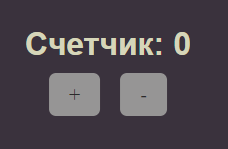
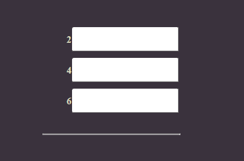

██╗░░░██╗██╗░░░██╗███████╗  ░░░░░██╗░██████╗
██║░░░██║██║░░░██║██╔════╝  ░░░░░██║██╔════╝
╚██╗░██╔╝██║░░░██║█████╗░░  ░░░░░██║╚█████╗░
░╚████╔╝░██║░░░██║██╔══╝░░  ██╗░░██║░╚═══██╗
░░╚██╔╝░░╚██████╔╝███████╗  ╚█████╔╝██████╔╝
░░░╚═╝░░░░╚═════╝░╚══════╝  ░╚════╝░╚═════╝░
---
# 1 Основы
## 1.1 Пример кода простого приложения (1)
```js
const App = {
    data() {
        return {
            counter: 0,
        }
    }
}

Vue.createApp(App).mount("#app")
```

```html
<!DOCTYPE html>
<html lang="en">
<head>
    <meta charset="UTF-8">
    <meta name="viewport" content="width=device-width, initial-scale=1.0">
    <link rel="stylesheet" href="style.css">
    <title>Document</title>
    
</head>
<body>
    <div id="app" class="container noselect">
        <div class="card">
            <h1>Счетчик: {{ counter }}</h1>
            <div class="row">
                <div class="btn" v-on:click="counter++">+</div>
                <div class="btn" @click="counter--">-</div>
            </div>
        </div>
    </div>

    <script src="https://unpkg.com/vue@3/dist/vue.global.js"></script>
    <script src="app.js"></script>
</body>
</html>
```

<div style="text-align:center"></div>

## 1.2 Пример кода простого приложения (2)
```js
const App = {

    data() {
        return {
            title: 'Список',
            placeholderText: 'Введите текст',
            inputValue: '',
            notes: ['Заметка 1', 'Заметка 2']
        }
    },
    methods: {
        inputChangeHandler(event) {
            this.inputValue = event.target.value
        },
        addNewNote() {
            this.notes.push(this.inputValue)
            this.inputValue = ''
        },
        removeNote(index) {
            this.notes.splice(index, 1)
        },
    }
}

Vue.createApp(App).mount("#app")
```

```html
<!DOCTYPE html>
<html lang="en">
<head>
    <meta charset="UTF-8">
    <meta name="viewport" content="width=device-width, initial-scale=1.0">
    <link rel="stylesheet" href="style.css">
    <title>Document</title>
    
</head>
<body>
    <div id="app" class="container noselect">
        <div class="card">
            <h1>{{ title }}</h1>
            <div class="form-control">
                <input 
                    type="text"
                    v-bind:placeholder="placeholderText"
                    v-bind:value="inputValue"
                    v-on:input="inputChangeHandler"
                    v-on:keypress.enter="addNewNote"
                />
            </div>
            <div class="btn" v-on:click="addNewNote">Добавить</div>
            <div class="row" v-for="(note, idx) in notes">
                <h2>{{idx + 1}}. {{ note }}</h2>
                <div class="btn" v-on:click="removeNote(idx)">x</div>
            </div>
            
        </div>
    </div>

    <script src="https://unpkg.com/vue@3/dist/vue.global.js"></script>
    <script src="app.js"></script>
</body>
</html>
```

<div style="text-align:center"></div>

## 1.3 Сокращения

Для сокращения вместо "v-bind:" можно писать ":", а вместо "v-on:" писать "@". Пример использования сокращений:

```html
<!DOCTYPE html>
<html lang="en">
<head>
    <meta charset="UTF-8">
    <meta name="viewport" content="width=device-width, initial-scale=1.0">
    <link rel="stylesheet" href="style.css">
    <title>Document</title>
    
</head>
<body>
    <div id="app" class="container noselect">
        <div class="card">
            <h1>{{ title }}</h1>
            <div class="form-control">
                <input 
                    type="text"
                    :placeholder="placeholderText"
                    :value="inputValue"
                    @input="inputChangeHandler"
                    @keypress.enter="addNewNote"
                />
            </div>
            <div class="btn" @click="addNewNote">Добавить</div>
            <div class="row" v-for="(note, idx) in notes">
                <h2>{{idx + 1}}. {{ note }}</h2>
                <div class="btn" @click="removeNote(idx)">x</div>
            </div>
            
        </div>
    </div>

    <script src="https://unpkg.com/vue@3/dist/vue.global.js"></script>
    <script src="app.js"></script>
</body>
</html>
```

## 1.4 Computed

Computed (вычисляемые) свойства должны что-то возвращать и зависить от каких-то переменных приложения.
Обращаться к ним надо не как к свойствам, а как к обычным переменным, т.к. это по сути геттеры и сеттеры.
<ins>Методы computed будут вызываться только если будут меняться переменные внутри этих методов.</ins> Пример:
```html
<h2>Всего элементов: {{ notes.length }} | Удвоенное кол-во: {{ doubleCountComputed }}</h2>
```

```js
const App = {

    data() {
        return {
            title: 'Список',
            placeholderText: 'Введите текст',
            inputValue: '',
            notes: ['Заметка 1', 'Заметка 2']
        }
    },
    methods: {
        inputChangeHandler(event) {
            this.inputValue = event.target.value
        },
        addNewNote() {
            if(this.inputValue === '') return
            this.notes.push(this.inputValue)
            this.inputValue = ''
        },
        removeNote(index) {
            this.notes.splice(index, 1)
        },
        doubleCount() {
            console.log('doubleCount')
            return this.notes.length * 2
        }
    },
    computed: {
        doubleCountComputed() {
            console.log('doubleCountComputed')
            return this.notes.length * 2
        }
    }
}

Vue.createApp(App).mount("#app")
```

## 1.5 Watch
С этим свойством мы можем следить за любыми переменными. Например будем следить за переменной inputValue, для этого в объекте watch нужно создать метод, совпадающий по названию с переменной.
```js
const App = {

    data() {
        return {
            title: 'Список',
            placeholderText: 'Введите текст',
            inputValue: '',
            notes: ['Заметка 1', 'Заметка 2']
        }
    },
    methods: {
        inputChangeHandler(event) {
            this.inputValue = event.target.value
        },
        addNewNote() {
            if(this.inputValue === '') return
            this.notes.push(this.inputValue)
            this.inputValue = ''
        },
        removeNote(index) {
            this.notes.splice(index, 1)
        },
        doubleCount() {
            console.log('doubleCount')
            return this.notes.length * 2
        }
    },
    computed: {
        doubleCountComputed() {
            console.log('doubleCountComputed')
            return this.notes.length * 2
        }
    },
    watch: {
        inputValue(value) {
            if(value.length > 10) this.inputValue = ''
            console.log('input value watch: ' + value)
        }
    }
}

Vue.createApp(App).mount("#app")
```

## 1.6 V-model

Позволяет заменить обработку события и например убрать __v-bind:value__ и __v-on:input__ с их функциями обработки.

Пример:

```html
<input 
 type="text"
 :placeholder="placeholderText"
 :value="inputValue"
 @input="inputChangeHandler"
 @keypress.enter="addNewNote"
/>
```
Меняется на:
```html
<input 
 type="text"
 :placeholder="placeholderText"
 v-model="inputValue"
 @keypress.enter="addNewNote"
/>

```

## 1.7 Style
Для прописывание стилей нужно ставить объект.

Когда пишем свойства для стилизации объектов со стороны JS, и свойство состоит из нескольких слов (пример font-size), то нужно использовать cammelCase (fontSize)
```html
<h1 :style="{
  color: inputValue.length < 3 ? 'red' : 'green',
  fontSize: inputValue.length < 5 ? '20px' : '30px'
}">{{ title }}</h1>
```

## 1.8 Class

Вариант 1) Объект, как в стилях, ставить не нужно.

```html
<h2 :class="idx == 1 ? 'oneClass' : 'secondClass'">{{idx + 1}}. {{ note }}</h2>
```

Вариант 2) Задаем объект и указываем название класса, а потом прописываем условие для него

```html
<h2 :class="{
  'oneClass': idx == 1,
  'secondClass': idx != 1
}">{{idx + 1}}. {{ note }}</h2>
```

Вариант 3) Можем передать массив, в качестве элементов массива можем передавать какие-то классы и объекты.

```html
<h2 :class="['oneClass', {'secondClass': idx != 1}]">{{idx + 1}}. {{ note }}</h2>
```
Тут все элементы получат класс 'oneClass', а класс 'seconsClass' получат только элементы, у которых выполнится условие

# 2 Что еще есть во Vue
## 2.1 Альтернативная инициализация vue

```js
Vue.createApp({
    data:() => ({
        title: 'Заголовок'
    })
}).mount("#app")
```

[Различные другие директивы, такие как v-cloak, v-html и др.](https://vuejs.org/guide/essentials/template-syntax.html)

## 2.2 Key
Существует специальный атрибут key, нужен для предотвращения бага с DOM обработчиком, когда из-за оптимизации удаляется не совсем тот элемент.
```html
<li>
    class="list-item"
    v-for="(item, i) in items"
    @click="items.splice(i, 1)"
    :key="item"
</li>
```

## 2.3 Фильтрация
```html
<!DOCTYPE html>
<html lang="en">
<head>
    <meta charset="UTF-8">
    <meta name="viewport" content="width=device-width, initial-scale=1.0">
    <link rel="stylesheet" href="style.css">
    <title>Document</title>
    <style>
        [v-cloak] {display: none;}
    </style>
</head>
<body>
    <div id="app" v-cloak class="container noselect">
        <div class="card">
            <ul>
                <li
                    v-for="(item, i) in evenItems"
                    @click="items.splice(i, 1)"
                    :key="item"
                >
                    <strong>{{ item }}</strong>
                    <input type="text" @click.stop>
                </li>
            </ul>
        </div>
    </div>

    <script src="https://unpkg.com/vue@3/dist/vue.global.js"></script>
    <script src="app.js"></script>
</body>
</html>
```

```js
Vue.createApp({
    data:() => ({
        items: [1, 2, 3, 4, 5, 6],

    }),
    methods: {

    },
    computed: {
        evenItems() {
            return this.items.filter(i => i % 2 === 0)
        }
    },
    watch: {
        
    }
}).mount("#app")
```

<div style="text-align:center"></div>

## 2.4 Модификаторы
Модификаторы позволяют избавиться от большого количества кода для обработки нажатий и определенных событий.
```html
<!DOCTYPE html>
<html lang="en">
<head>
    <meta charset="UTF-8">
    <meta name="viewport" content="width=device-width, initial-scale=1.0">
    <link rel="stylesheet" href="style.css">
    <title>Document</title>
    <style>
        [v-cloak] {display: none;}
    </style>
</head>
<body>
    <div id="app" v-cloak class="container noselect">
        <div class="card">
            <div>
                <input type="text" @keyup.shift.enter="addItem" ref="myInput">
            </div>
            <ul v-if="items.length">
                <li
                    v-for="(item, i) in items"
                    @click.right.prevent="items.splice(i, 1)"
                    :key="item"
                >
                    <strong>{{ item }}</strong>
                    <input type="text" @click.stop>
                </li>
            </ul>
        </div>
    </div>

    <script src="https://unpkg.com/vue@3/dist/vue.global.js"></script>
    <script src="app.js"></script>
</body>
</html>
```
```js
Vue.createApp({
    data:() => ({
        items: [1, 2],

    }),
    methods: {
        addItem(event) {
            this.items.unshift(this.$refs.myInput.value)
            this.$refs.myInput.value = ''
            console.log(event)
        },
    },
    computed: {
        evenItems() {
            return this.items.filter(i => i % 2 === 0)
        }
    },
    watch: {
        
    }
}).mount("#app")
```
[Модификаторы Vue JS](https://ru.vuejs.org/guide/essentials/event-handling.html)

## 2.5 Вызов нескольких функций
Просто перечисляем через запятую
```html
@click.right.prevent="remove(i), log(item)"
```

# 3 Как работает Vue